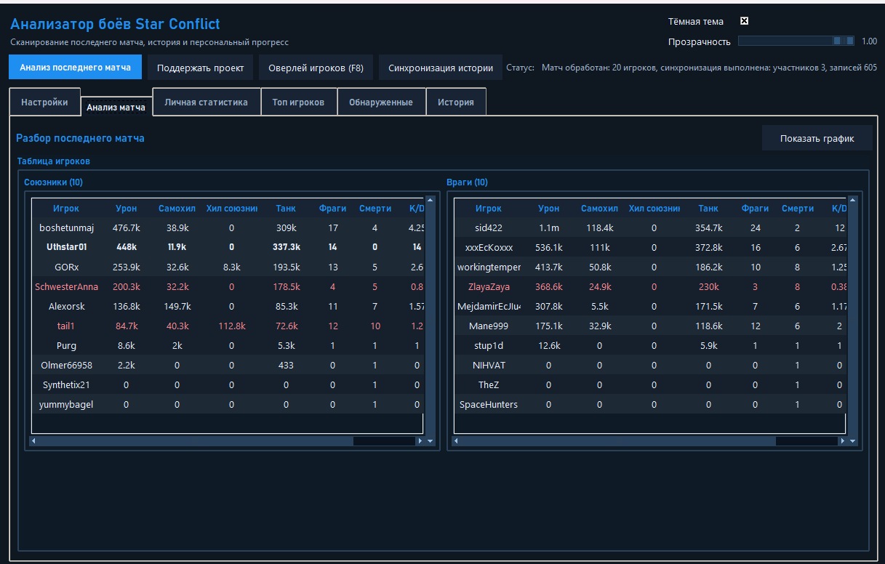
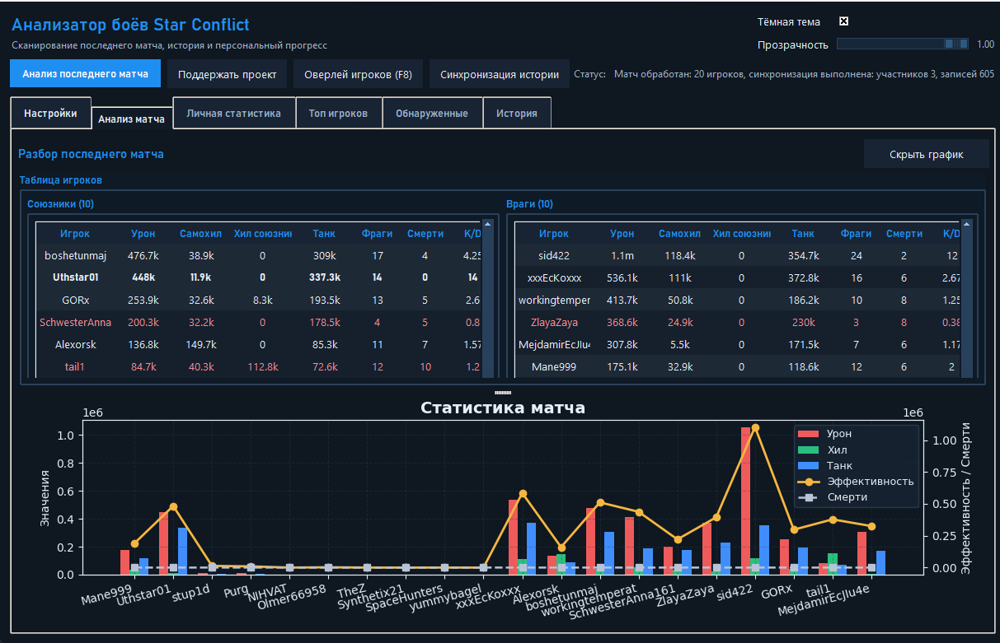
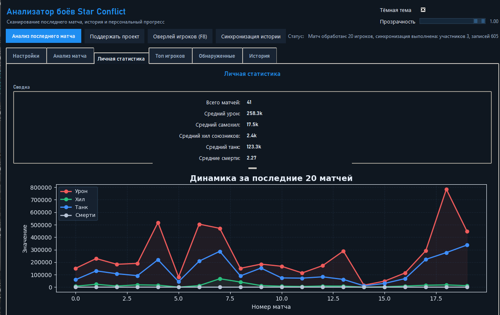
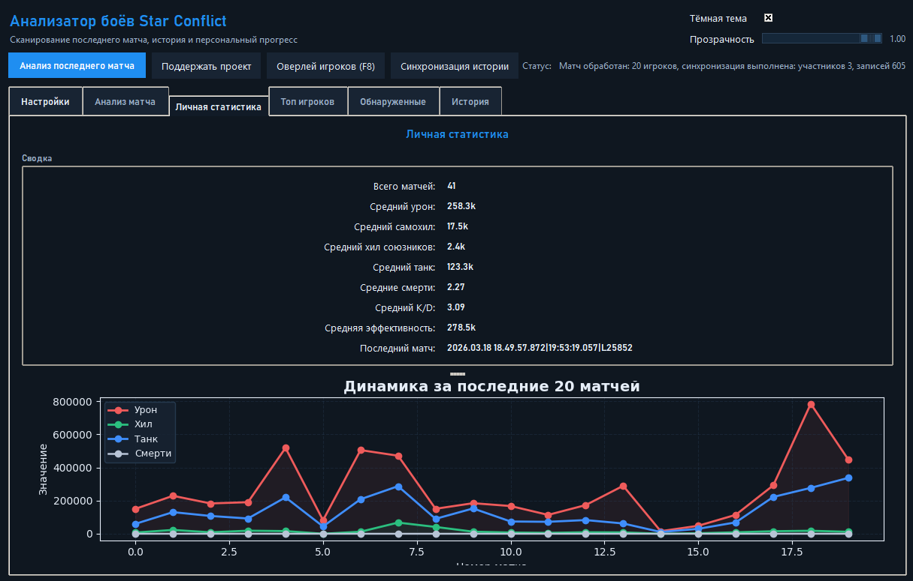
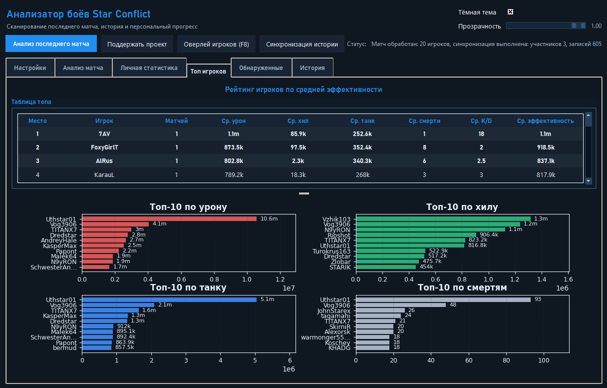
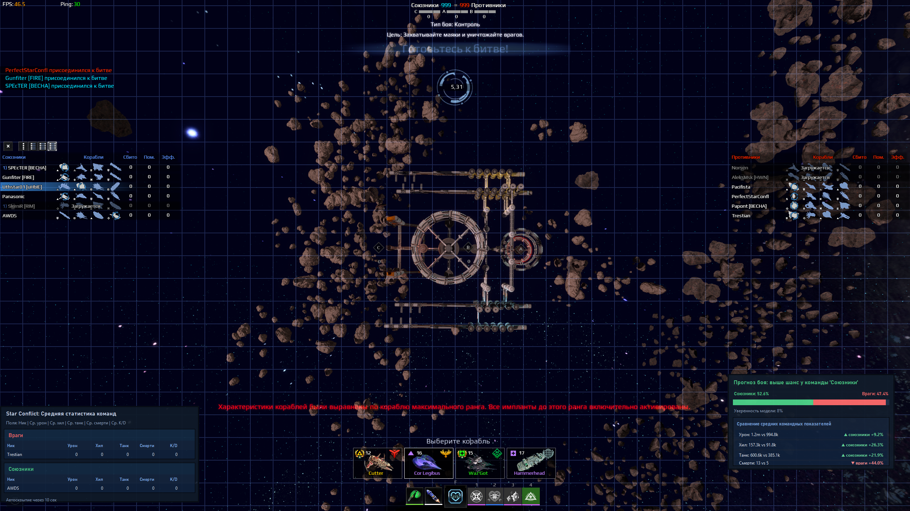
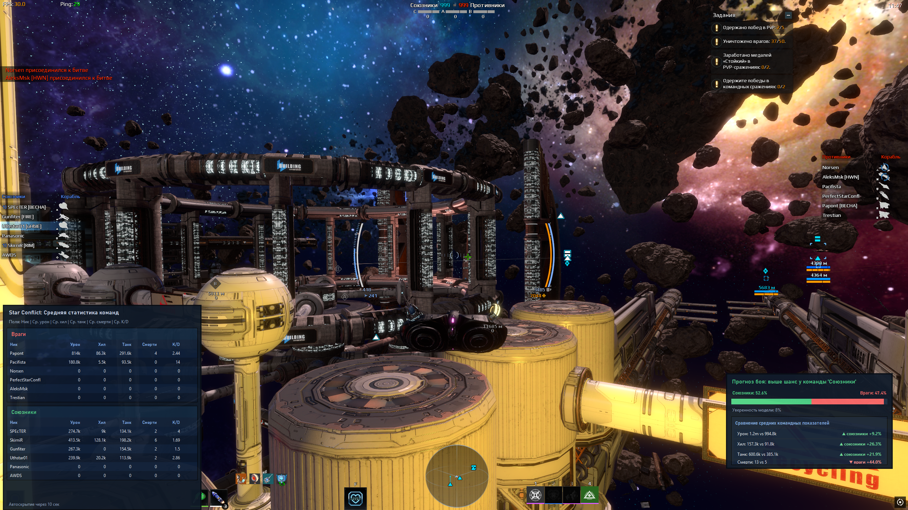

# Star Conflict Log Analyzer


Десктопное приложение для анализа логов игры Star Conflict. Автоматически парсит последний бой, считает статистику игроков и сохраняет историю матчей.

## 🚀 Возможности

- ✅ Парсинг **последнего завершённого матча** из логов игры
- ✅ Расчёт **эффективности** игрока на основе:
  - Урона (`damage`)
  - Самоисцеления (`self_heal`)
  - Исцеления союзников (`team_heal`)
  - Танкования (`tank`)
  - Количества убийств (`kills`)
- ✅ Выявление игроков с **повышенным уровнем «доната»** (cheat_lvl) — их эффективность снижается вдвое
- ✅ Сохранение всех матчей в **историю** (JSON)
- ✅ Личная статистика: средние показатели, график прогресса
- ✅ Топ-10 игроков по урону, хилу и танкованию
- ✅ Просмотр истории матчей с возможностью загрузить любой бой 
- ✅ **Тёмная/светлая тема** и настройка прозрачности окна
- ✅ Премиум оверлеи - прогноз боя по статистике в игре(РАБОТАЕТ ТОЛЬКО ПРИ ИГРЕ В ОКНЕ(можно окно без рамок))

## 🖥️ Скриншоты










## 📦 Требования

- Python 3.10 или выше
- Библиотеки: `pandas`, `matplotlib`, `tkinter` (входит в стандартную поставку Python)

## 🔧 Установка

1. Клонируйте репозиторий:
   ```bash
   git clone https://github.com/Uthstar0123/Star-Conflict_logs
   cd Star-Conflict_logs
   ```

2. (Рекомендуется) Создайте виртуальное окружение:
   ```bash
   python -m venv venv
   source venv/bin/activate  # Linux/Mac
   venv\Scripts\activate     # Windows
   ```

3. Установите зависимости:
   ```bash
   pip install pandas matplotlib
   ```

4. Запустите приложение:
   ```bash
   python main.py
   ```

## 🎮 Использование

1. **Настройки**:
   - Укажите свой ник в игре.
   - Выберите папку с логами Star Conflict (обычно `.../StarConflict/Logs/`).
   - Сохраните настройки.

2. **Анализ матча**:
   - Нажмите кнопку **«Матч завершен»** — программа найдёт последний бой и отобразит статистику.
   - Если обнаружены «донатёры», появится предупреждение.

3. **Личная статистика**:
   - После анализа матч автоматически добавляется в историю.
   - Во вкладке «Личная статистика» отобразятся средние показатели и график прогресса.

4. **Топ игроков**:
   - Строится на основе всей накопленной истории.

5. **История**:
   - Список всех сыгранных матчей. Двойной клик по матчу загрузит его данные во вкладку анализа.

## ⚙️ Конфигурация

Настройки хранятся в файле `config.json` в папке программы:
```json
{
    "nick": "ВашНик",
    "log_dir": "C:/Users/.../StarConflict/Logs",
    "dark_theme": true,
    "alpha": 0.92
}
```

## 📂 Формат истории

История матчей сохраняется в `history.json`. Каждая запись содержит:
- `nick` — игрок
- `damage`, `self_heal`, `team_heal`, `tank`, `kills`
- `efficiency` — эффективность
- `match_date` — дата/время матча (берётся из имени папки лога)

## 🛠️ Сборка в исполняемый файл (опционально)

Для создания `.exe` используйте Nuitka:
```bash
pip install nuitka
python -m nuitka --onefile --standalone --windows-disable-console --enable-plugin=tk-inter --include-data-dir=gui=gui --include-data-dir=core=core --include-data-dir=utils=utils --include-data-files=icon.ico=icon.ico main.py
```

## 📄 Лицензия

Проект распространяется под лицензией MIT. Подробнее — в файле [LICENSE](LICENSE).

## 👤 Автор 

 - Uthstar01  
[DonationAlerts](https://www.donationalerts.com/r/restramer) (если хотите поддержать)


